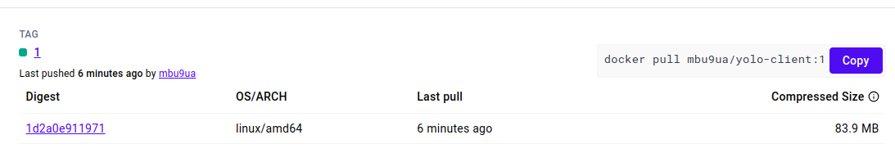

## Choice of the base image on which to build each container
### Client Container:

Base Image: node:14-alpine3.16
Reasoning: This image is a lightweight version of Node.js, which is suitable for building and running a React application. The alpine variant ensures a smaller image size, reducing the attack surface and improving build speed.

### Backend Container:

Base Image: node:14-alpine3.16
Reasoning: Similar to the client container, this image provides a lightweight and efficient environment for running a Node.js backend application, specifically tailored for production environments.

### MongoDB Container:

Base Image: mongo:latest
Reasoning: This is the official MongoDB image, ensuring compatibility and reliability. It includes all necessary dependencies to run MongoDB out of the box

## Dockerfile directives used in the creation and running of each container
### Client Dockerfile:

Build Stage: Uses node:14-alpine3.16 to install dependencies and build the application.
Production Stage: Uses node:16-alpine3.16 to create a production-ready environment with only the necessary build artifacts.

### Backend Dockerfile:

Sets the working directory, installs dependencies, copies the application code, and exposes port 5000 for the Node.js application.

## Docker-compose Networking (Application port allocation and a bridge network implementation) 
### Docker-Compose Networking:

A bridge network named app-network is created to enable communication between the client, backend, and MongoDB containers. This isolates the application from other Docker networks and enhances security.

## Docker-compose volume definition and usage
### Volume Definition:

A named volume mongo_data is created to persist MongoDB data, ensuring that the data remains intact even if the MongoDB container is stopped or removed.

## Git workflow used to achieve the task
### Branches:

master: The main branch for deployment.
mbuguajnr23-patch-1: A feature branch used for implementing and testing the Docker setup.
Commits:

### Regular commits with descriptive messages to track progress and changes.
Ensured at least 10 meaningful commits throughout the project development.
Successful running of the applications and if not, debugging measures applied
Status:

### The client and backend images were built successfully.
The application runs with Docker Compose, but the GitHub Actions workflow encountered an error due to incorrect Docker Hub authentication.

Debugging Measures:

Verified the Docker Hub access token and ensured it is correctly stored in GitHub Secrets.
Reviewed and corrected the docker/login-action step in the GitHub Actions workflow.

### Image Tagging:
Used git commit count as tags for Docker images.
Example tags:  yolo-client:1, yolo-client:2

## Ansible Playbook Explanation

### Variables
- `docker_version`: Specifies the Docker version to install.
- `app_repo`: URL of the application repository.
- `app_dir`: Directory to clone the application into.

### Roles
1. **docker**: Installs and starts Docker.
2. **web**: Clones the application repository and runs the web application container.
3. **mongo**: Runs the MongoDB container.

### Playbook Execution Order
1. Install necessary packages.
2. Install and start Docker.
3. Clone the application repository.
4. Build and run the web application container.
5. Run MongoDB container.

### Tags
- `install_packages`
- `install_docker`
- `start_docker`
- `clone_repo`
- `run_web_container`
- `run_mongo_container`
